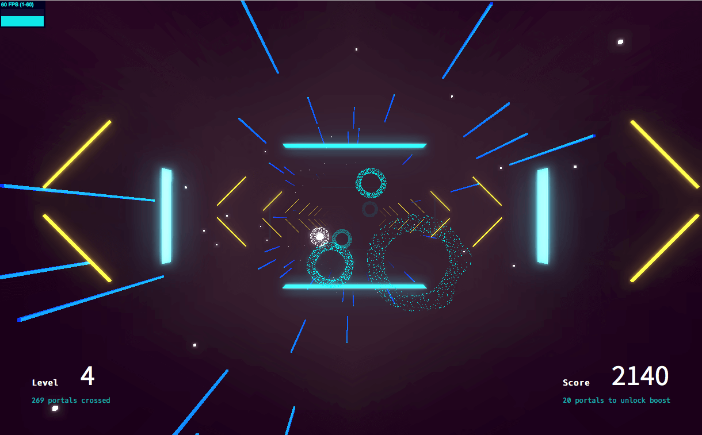

# Portals (Audio Experiment)
> Interactive audio experiment with ThreeJS.

Cross portals with your cursor to score. 




## Installation

### Install Dependencies
```sh
npm install
```

### Run Server
``` bash
npm run start
```

### Build your app
``` bash
npm run build
```

## Built With

* [Webpack](https://webpack.js.org/) - Webpack is a module bundler for modern JavaScript applications.
* [Three.js](https://threejs.org/) - A cross-browser JavaScript library used to create and display animated 3D computer graphics in a web browser.

## Meta

Arnaud Pinot – [@PinotArnaud](https://twitter.com/PinotArnaud) – [https://github.com/arnvvd](https://github.com/arnvvd/)